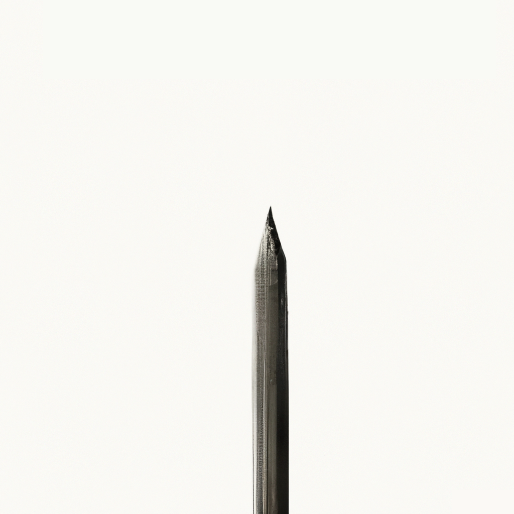
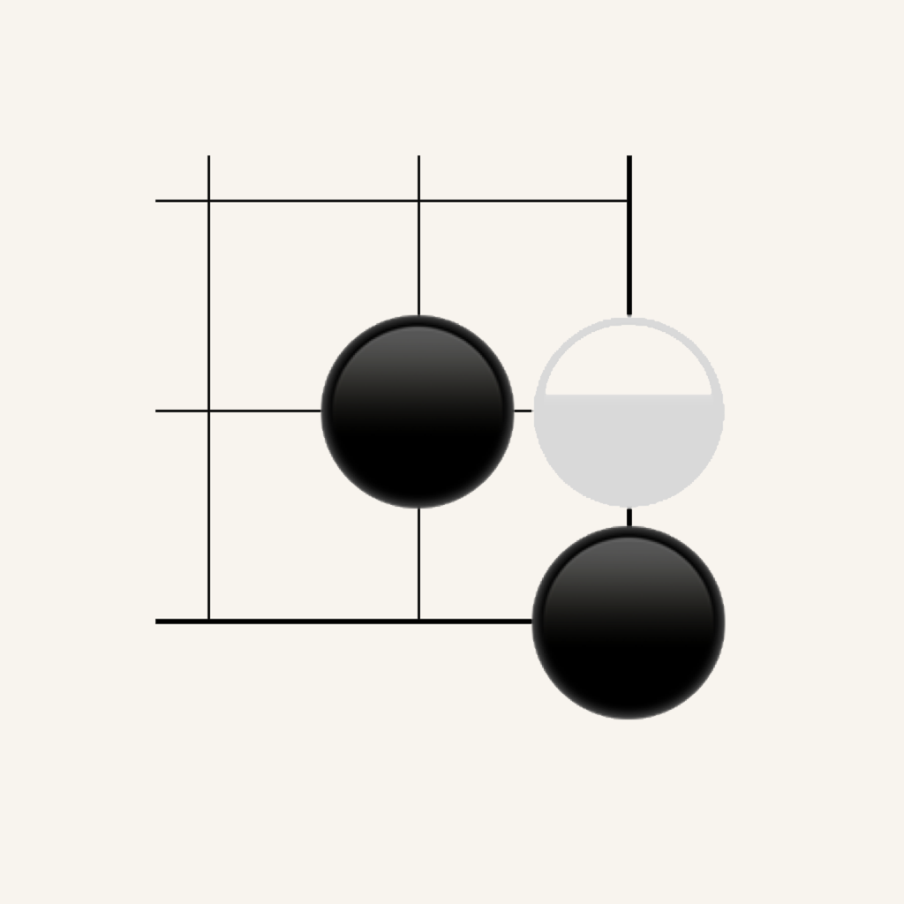

# Apps

## group?

Never forget people again.

[Website](https://groupquestionmark.com/)  

## wrblr

Sharing with just your friends.

[Blog Post](/2023/08/29/wrblr-social-media-launch-wrblr.html)

## Dailies

A daily planning app I made to replace the notebooks I was filling over the years.

[GitHub](https://github.com/kevin49999/Dailies)  

## Go - Play with Friends

An app for playing Go with a friend next to you.

[GitHub](https://github.com/kevin49999/Go-iOS)   

## Paintball BST

A marketplace project I worked on from 2017-2018. I wrote a [blog post](/2018/11/11/sunsetting-iOS-side-project.html) about the experience. I was the sole developer, wrote the iOS app, backend code (before migrating to Firebase), and ran the social media.

## Waveman

A sprite game where I drew and made pixel art (thanks to this [tutorial](https://makegames.tumblr.com/post/42648699708/pixel-art-tutorial) written by the creator of the famous game Spelunky). Written in 2015 in Objective-C.

[GitHub](https://github.com/kevin49999/Waveman)

# Misc.

These assorted projects/ideas and more can be found on my [GitHub page](https://github.com/kevin49999).

## nand2tetris-swift

An assembler, vm translator, and compiler written in Swift for the [nand2tetris](https://www.nand2tetris.org/) course.

## DoomFireSwift/FizzleFade

I recreated old-school id Software game effects for iOS using Fabien Sanglard's [great blog](https://fabiensanglard.net/doom_fire_psx/index.html) as the reference.

## CARAssetsAnalyzer

Analyze your app's assets in an app. Displays sizing information and displays what images would look like unconstrained. 

The goal was to use this to find unused and improperly sized images in a project I was working on at the time.

## ActivityNavigationItem

Animates loading after tapping a navigation item button on iOS. Install with SPM or CocoaPods.

## ImageAlertPresenter

Inspired by the AirDrop alert on iOS. Present `UIAlertController` with a configurable image.
