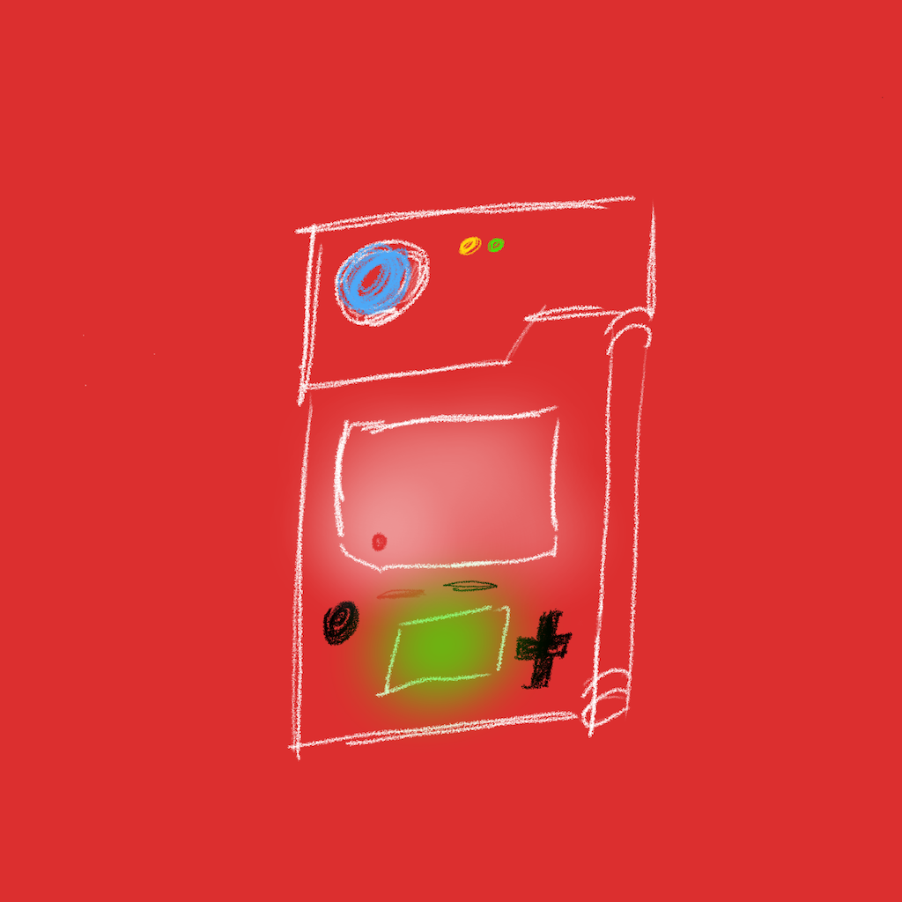
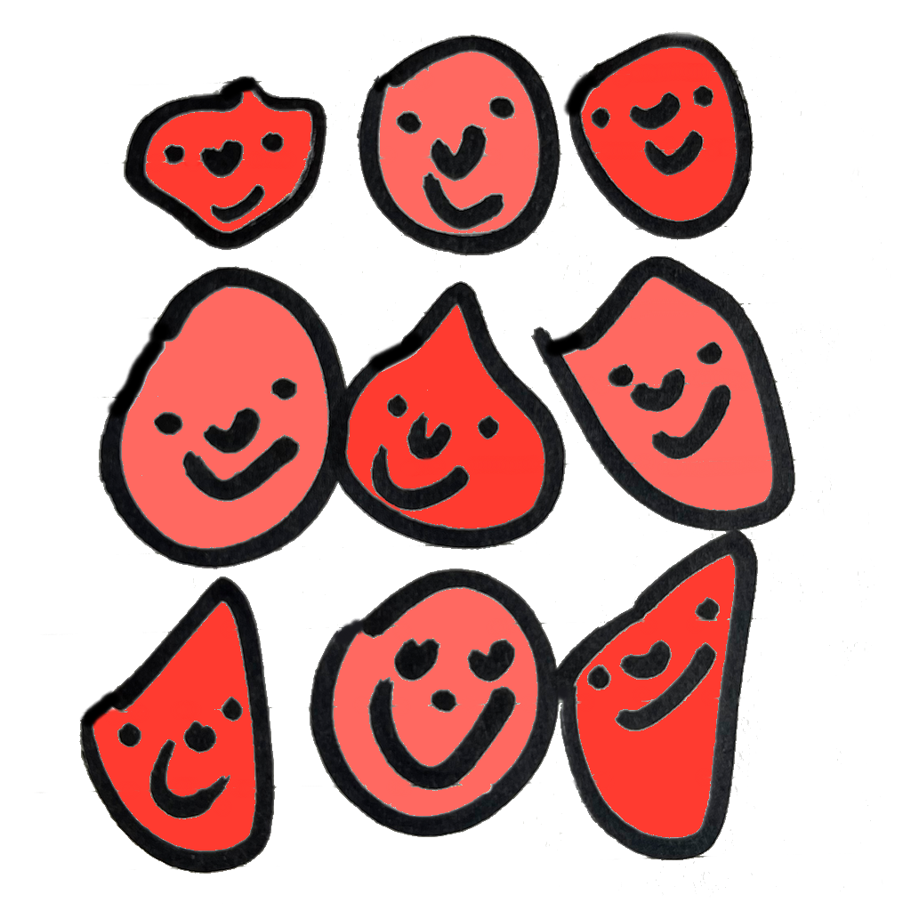
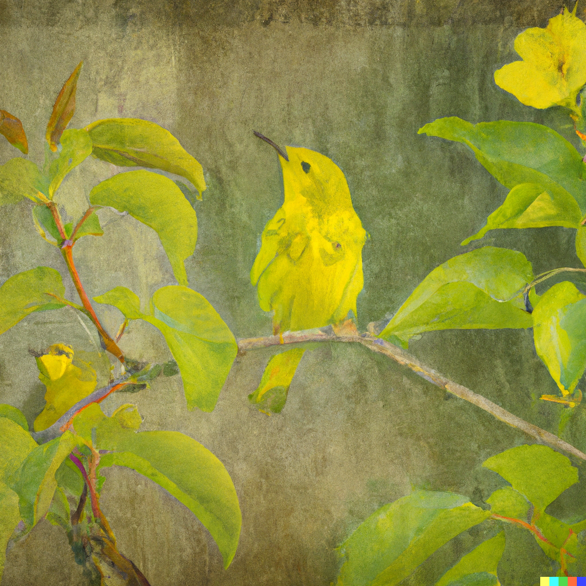
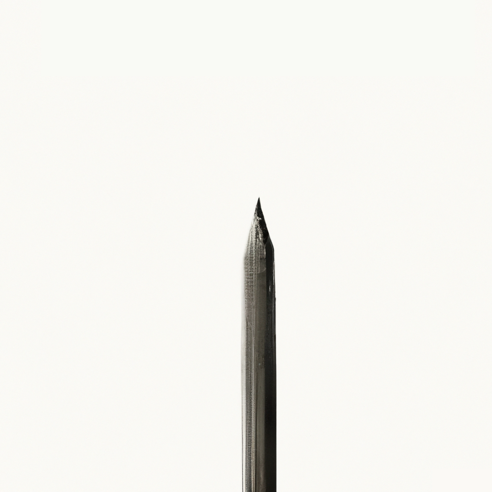
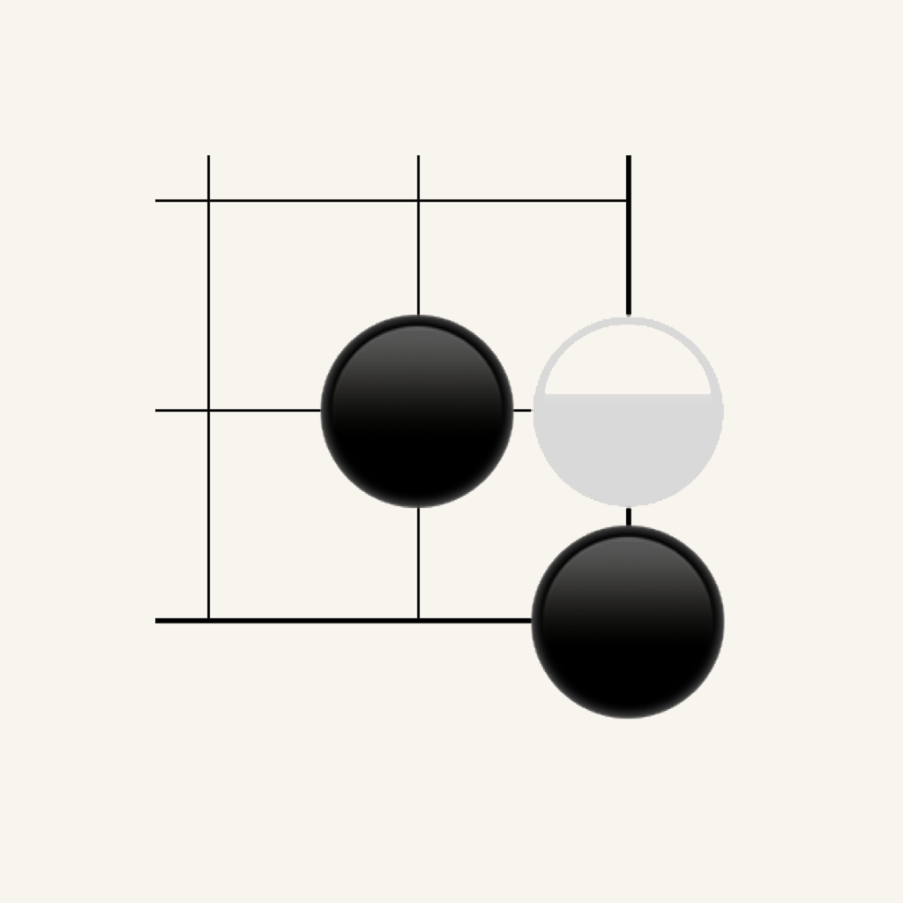

# Apps

## Birderdex

Fun way to keep a birding life list. Made with my brother who generated the bird data and pixel images.

Built with SwiftUI. Used [Rive](https://rive.app/) to create button and blue LED animation.

Bird description text uses a typewriter style [TextRenderer](https://developer.apple.com/documentation/swiftui/textrenderer) and a Metal shader for the green background.

## group

Never forget people again. A super simple and easy to use "personal CRM" type app.

Built with SwiftUI.

Uses Firebase for the backend:
 - Auth (Email/PW, Apple, Anonymous)
 - Firestore
 - Storage
 - Functions

## wrblr

[Blog Post](/2023/08/29/wrblr-social-media-launch-wrblr.html)

Sharing with just your friends. Very fun and difficult to make minimal social media app. 

Supported fullscreen image viewing and allowed users to save images. Friends were contacts you followed or usernames you searched for. I was your default first friend in honor of Myspace Tom.

Had close to 100 signed-up users and some beautiful posts with comments and reactions.

Built with UIKit.

Used Firebase for the backend:
 - Auth (Phone)
 - Firestore
 - Storage
 - Functions
 - App Check

## Dailies

[GitHub](https://github.com/kevin49999/Dailies)  

A daily planning app I made to replace the notebooks I was filling over the years.

Built with UIKit. I still use this app every single day and love it.

## Go - Play with Friends

[GitHub](https://github.com/kevin49999/Go-iOS)   

An app for playing Go with a friend next to you.

Built with UIKit. Has had 30 DAUs with people all over the world using it the past few years. I haven't found someone to play Go with irl yet.

## Paintball BST

A marketplace project I worked on from 2017-2018. I wrote a [blog post](/2018/11/11/sunsetting-iOS-side-project.html) about the experience. I was the sole developer, wrote the iOS app (UIKit), backend code (before migrating to Firebase), and ran the [social media](https://www.instagram.com/paintballbstapp/).

## Waveman

[GitHub](https://github.com/kevin49999/Waveman)

A sprite game where I drew and made pixel art (thanks to this [tutorial](https://makegames.tumblr.com/post/42648699708/pixel-art-tutorial) written by the creator of the famous game Spelunky). Written in 2015 in Objective-C.

# Misc.

These assorted projects/ideas and more can be found on my [GitHub page](https://github.com/kevin49999).

## nand2tetris-swift

An assembler, vm translator, and compiler written in Swift for the [nand2tetris](https://www.nand2tetris.org/) course.

## DoomFireSwift/FizzleFade

I recreated old-school id Software game effects for iOS using Fabien Sanglard's [great blog](https://fabiensanglard.net/doom_fire_psx/index.html) as the reference.

## CARAssetsAnalyzer

Analyze your app's assets in an app. Displays sizing information and displays what images would look like unconstrained. 

The goal was to use this to find unused and improperly sized images in a project I was working on at the time.

## ActivityNavigationItem

Animates loading after tapping a navigation item button on iOS. Install with SPM or CocoaPods.

## ImageAlertPresenter

Inspired by the AirDrop alert on iOS. Present UIAlertController with a configurable image.
